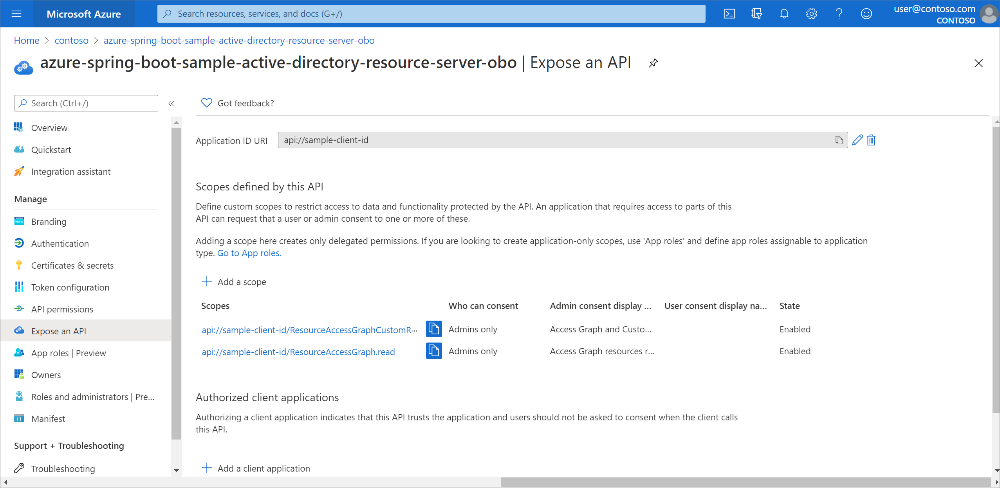

# OAuth 2.0 Sample for azure-spring-boot-sample-active-directory-resource-server-obo library for Java

## Key concepts
[Resource server access other resources usage][resource-server-access-other-resources-usage] is an extension scenario of the *azure-spring-boot-sample-active-directory-spring-security-resource-server* sample. Similarly, this sample illustrates how to protect a Java web API by restricting access to its resources to authorized accounts, and the restricted resource will access other restricted resource, such as Graph API and Custom API.


## Getting started
We will prepare two application to demonstrate the dependent calls of resources.
Another sample [spring security resource server sample][azure-spring-boot-sample-active-directory-spring-security-resource-server] will be as Custom API resource.

### Environment checklist
We need to ensure that this [environment checklist][ready-to-run-checklist] is completed before the run.

### Include the package

```xml
<dependencies>
    <dependency>
      <groupId>org.springframework.boot</groupId>
      <artifactId>spring-boot-starter-web</artifactId>
    </dependency>
    <dependency>
      <groupId>org.springframework.boot</groupId>
      <artifactId>spring-boot-starter-security</artifactId>
    </dependency>
    <dependency>
      <groupId>com.azure.spring</groupId>
      <artifactId>azure-spring-boot-starter-active-directory</artifactId>
      <version>3.0.0-beta.2</version> <!-- {x-version-update;com.azure.spring:azure-spring-boot-starter-active-directory;current} -->
    </dependency>
    <dependency>
      <groupId>org.springframework.security</groupId>
      <artifactId>spring-security-oauth2-resource-server</artifactId>
    </dependency>
    <dependency>
      <groupId>org.springframework.security</groupId>
      <artifactId>spring-security-oauth2-client</artifactId>
    </dependency>
    <dependency>
      <groupId>com.microsoft.azure</groupId>
      <artifactId>msal4j</artifactId>
      <version>1.8.0</version> <!-- {x-version-update;com.microsoft.azure:msal4j;external_dependency} -->
    </dependency>
    <dependency>
      <groupId>com.microsoft.azure</groupId>
      <artifactId>msal4j</artifactId>
      <version>1.8.0</version> <!-- {x-version-update;com.microsoft.azure:msal4j;external_dependency} -->
    </dependency>
    <dependency>
      <groupId>org.springframework.security</groupId>
      <artifactId>spring-security-oauth2-jose</artifactId>
      <version>5.3.5.RELEASE</version> <!-- {x-version-update;org.springframework.security:spring-security-oauth2-jose;external_dependency} -->
    </dependency>
</dependencies>
```

### Register your Web API
You can follow *azure-spring-boot-sample-active-directory-spring-security-resource-server* sample to add `ResourceAccessGraph.read`, `ResourceAccessGraphCustomResources.read` scopes. 
Convention current application id url is `api://sample-client-id`, ; the application id url of the sample *azure-spring-boot-sample-active-directory-spring-security-resource-server* is `custom-client-id`.  
After adding as shown below:

   

### Add API permissions
The current Web API will access Graph API and Custom API. 

Sign in to the [Azure portal][azure-portal]. If you have access to multiple tenants, use the **Directory + subscription** filter  in the top menu to select the tenant containing your client app's registration.

#### Add Graph API Permission
1. Select **Azure Active Directory** > **App registrations**, and then select your current sample application (not your web API).

2. Select **API permissions** > **Add a permission** > **Microsoft APIs** > **Microsoft Graph** > **Delegated permissions**, select **User.Read**, select **Add permission** to complete the process.

#### Add Custom API Permission

1. Select **Azure Active Directory** > **App registrations**, and then select your current sample application (not your web API).

2. Select **API permissions** > **Add a permission** > **My APIs**, select *azure-spring-boot-sample-active-directory-spring-security-resource-server* application name.

3. **Delegated permissions** is selected by default， Select **File** > **File.Read** permission, select **Add permission** to complete the process.

### Grant consent for your tenant
Respectively grant admin consent to the Graph and Custom permissions. After adding as shown below:
   

## Examples

### Configure application.yaml

```yaml
azure:
  activedirectory:
    resource-server:
      obo:
        enabled: true
    client-id: [resource-server-application-client-id]
    client-secret: [resource-server-application-client-secret]
    tenant-id: [tenant-id-registered-by-application]
    app-id-uri: api://sample-client-id
    authorization:
      graph:
        scopes:
          - User.read
      custom:
        scopes:
          - api://custom-client-id/File.read
```

### Run with Maven 

```shell
cd azure-spring-boot-samples/azure-spring-boot-sample-active-directory-resource-server-obo
mvn spring-boot:run
```

### Access the Web API
First, you need to obtain an access token to access Sample API.
- API will Only call Graph resource. 
```shell script
# Replace to valid access token.
curl localhost:8081/call-graph-only -H "Authorization: Bearer <replace-the-access-token>"
```
Verify response:
```text
Graph response success.
```

- Sample API will Only call Graph resource. 

```shell script
# Replace to valid access token.
curl localhost:8081/call-graph-only -H "Authorization: Bearer <replace-the-access-token>"
# Another endpoint for access Graph resource.
curl localhost:8081/call-graph-only-with-annotation -H "Authorization: Bearer <replace-the-access-token>"
```

Verify response:
```text
Graph response success.
```

- Sample API will call Graph and Custom resources. 

```shell script
# Replace to valid access token.
curl localhost:8081/call-graph-and-custom-resources -H "Authorization: Bearer <replace-the-access-token>"
```

Verify response:
```text
Graph response success. Custom(local) response success.
```

## Troubleshooting

## Next steps
## Contributing

<!-- LINKS -->
[azure-portal]: https://portal.azure.com/
[ready-to-run-checklist]: https://github.com/Azure/azure-sdk-for-java/blob/master/sdk/spring/azure-spring-boot-samples/README.md#ready-to-run-checklist
[resource-server-access-other-resources-usage]: https://github.com/Azure/azure-sdk-for-java/tree/master/sdk/spring/azure-spring-boot-starter-active-directory#resource-server-access-other-resources-usage
